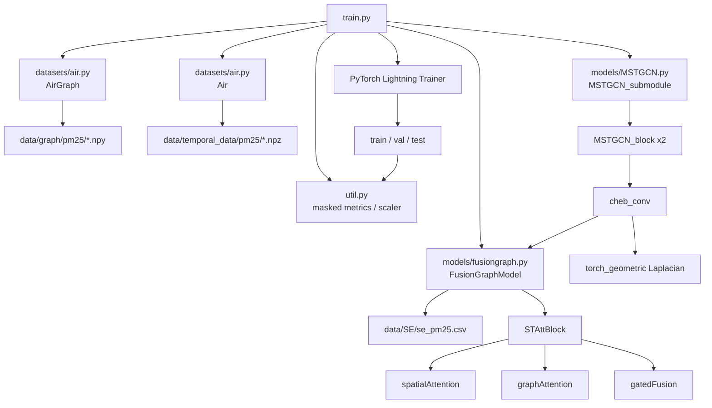

# MLSTGCN Module Map

## Module Call Graph

## Runtime Flow

1. `train.py` loads graph matrices and preprocessed PM2.5 samples.
2. `AirGraph` provides five candidate graphs: `dist`, `neighb`, `distri`, `tempp`, `func`.
3. `FusionGraphModel` fuses those graphs into one adjacency matrix for the current forward pass.
4. `MSTGCN_submodule` builds the graph Laplacian from that fused graph and runs spatial-temporal convolution.
5. `util.py` handles inverse scaling and masked MAE / MAPE / RMSE evaluation.

## Responsibilities By File

- `train.py`: experiment config, device selection, logger setup, Lightning training loop.
- `datasets/air.py`: PM2.5 dataset loading, graph selection, normalization.
- `models/fusiongraph.py`: multi-graph embedding, graph attention, fusion adjacency generation.
- `models/MSTGCN.py`: MSTGCN backbone using the fused graph.
- `util.py`: metrics, scaler, Lightning metric aggregation.
- `generate_training_data.py`: converts raw sequence data into sliding-window `npz` files.

## Data Shapes

- Input batch `x`: `[batch, hist_len, num_nodes, in_dim]`
- Label batch `y`: `[batch, pred_len, num_nodes, out_dim]`
- Fused graph: `[num_nodes, num_nodes]`
- Model output: `[batch, pred_len, num_nodes, out_dim]`

For the bundled PM2.5 data, the processed splits are:

- `train`: `(2186, 24, 92, 1)`
- `val`: `(728, 24, 92, 1)`
- `test`: `(729, 24, 92, 1)`
