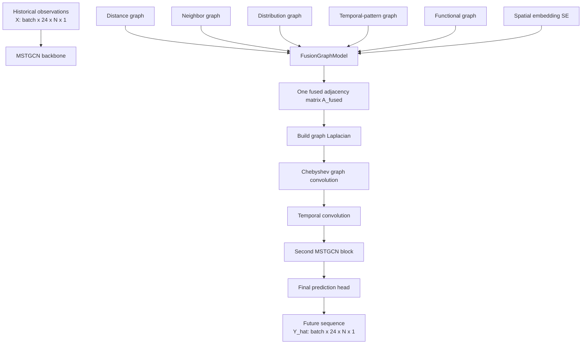

# Five-Graph Fusion To MSTGCN

## Method Flow

## Intuition

This model does not directly use one fixed graph. Instead, it starts from five different views of node relations, then learns how much each graph should contribute, and finally sends the fused graph into the temporal prediction backbone.

You can think of the whole method as:

- Step 1: describe node relations from multiple perspectives
- Step 2: fuse those perspectives into one graph
- Step 3: run spatio-temporal forecasting on that fused graph

## Detailed Step-By-Step Flow

### Step 1. Prepare five candidate graphs

Each graph gives one kind of prior structure:

- Distance graph
  - nearby nodes may influence each other more
- Neighbor graph
  - directly connected or locally adjacent nodes may interact
- Distribution graph
  - nodes with similar statistical distributions may behave similarly
- Temporal-pattern graph
  - nodes with similar daily or weekly curves may be related
- Functional graph
  - nodes with similar semantic roles may correlate

At this stage, each graph is still separate.

### Step 2. Load spatial embedding

The model reads a node embedding matrix `SE`.

Its role is to provide node-level context beyond raw adjacency values. In practice, this helps the fusion module distinguish node identities and structural roles when assigning graph weights.

### Step 3. Stack the graphs

Inside `FusionGraphModel`, the selected graphs are stacked together into a multi-graph tensor.

Conceptually:

- input: 5 matrices of shape `[N, N]`
- stacked form: a tensor containing all graph views together

This stacked representation is the input to the fusion logic.

### Step 4. Build graph-aware embedding

The model combines:

- graph values
- node spatial embedding `SE`
- graph identity information

This creates a richer representation for each node pair under each graph.

The point is: the fusion is not a simple scalar weighted sum. It can condition weights on both node identity and graph type.

### Step 5. Apply spatial attention

The spatial attention branch focuses on:

- which nodes are important to each other within a graph view

This helps the model detect stronger or weaker node-pair relevance under each graph.

### Step 6. Apply graph attention

The graph attention branch focuses on:

- how different graph views should influence each other

This is the cross-graph interaction part. Instead of treating the five graphs as isolated, it lets the model learn relationships across graph types.

### Step 7. Fuse the attention outputs

The outputs of spatial attention and graph attention are combined by gated fusion.

This gating step learns how much to trust:

- spatial-attention output
- graph-attention output

The result is a fused hidden representation that summarizes multi-graph information.

### Step 8. Generate the fused adjacency matrix

The fused representation is projected back to one matrix:

- `A_fused` with shape `[N, N]`

This matrix is the graph actually used during message passing in MSTGCN.

This is the key transition:

- from five prior graphs
- to one learned graph for forecasting

### Step 9. Build Laplacian from the fused graph

The MSTGCN backbone does not directly use the raw fused adjacency matrix. It first converts it into a graph Laplacian-related form suitable for Chebyshev graph convolution.

So the graph side becomes:

- `A_fused`
- Laplacian
- Chebyshev polynomials

### Step 10. Run graph convolution over each time slice

For each time step in the historical window, the model uses the fused graph structure to propagate information across nodes.

This extracts spatial dependencies:

- which nodes influence which other nodes
- under the learned fused graph

### Step 11. Run temporal convolution

After graph convolution, the model applies temporal convolution along the time axis.

This captures temporal dependencies:

- short-term local evolution
- sequential change patterns across the history window

### Step 12. Repeat the spatio-temporal block

The architecture uses stacked MSTGCN blocks, so the model can refine spatial-temporal features over multiple layers.

### Step 13. Output multi-step prediction

The final layer maps the learned features to:

- future `pred_len` steps for every node

In the bundled experiment:

- input length = 24
- prediction length = 24

## Short Summary

The method can be summarized as:

1. Start with five prior graphs.
2. Use attention and gating to learn one fused graph.
3. Use that fused graph inside MSTGCN.
4. Predict the future sequence for all nodes.

## What Is The Core Innovation

The core idea is not just "use graph convolution".

The more distinctive part is:

- using multiple prior graphs
- learning node-aware and graph-aware fusion weights
- letting the forecasting backbone consume the fused graph instead of a single hand-crafted graph

That is why `fusiongraph.py` is the conceptual center of this repository.
